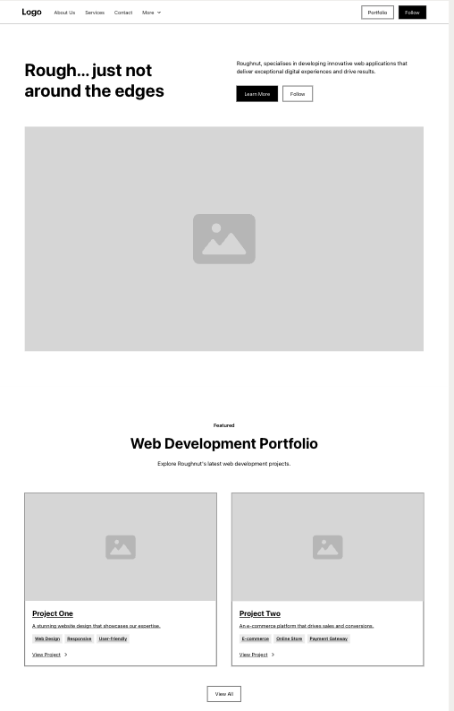
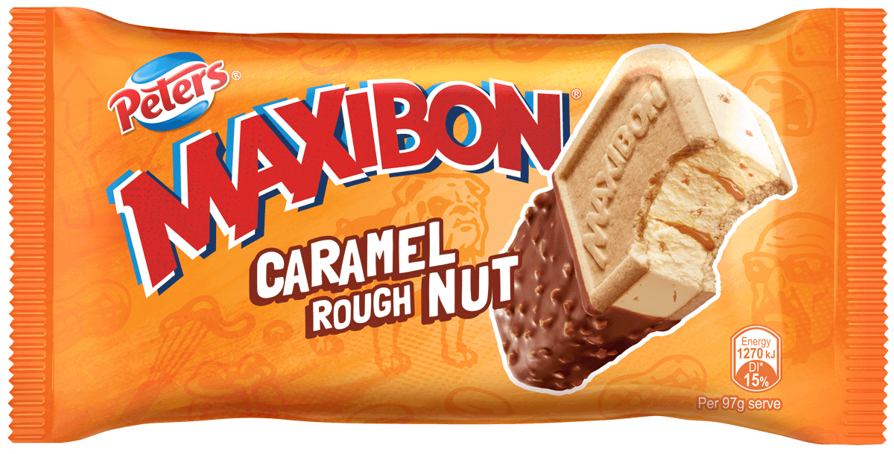

# Bootcamp Challenge 02 - Advanced CSS Challenge: Professional Portfolio

Coding bootcamp advanced CSS challenge to create a professional portfolio website from scratch.

## Description

Challenge is to build a professional coding portfolio using the advanced CSS concepts learned in Week 2 of coding bootcamp, including: flexbox, media queries and CSS variables.

[User Story](#user-story) and [Acceptance Criteria](#acceptance-criteria) are below

Also included below is my [Process & Learnings](#process-learnings) section.

## Usage

The site is deployed to [Github pages HERE](https://roughnut.github.io/bootcamp-challenge-02-advanced-css-challenge-professional-portfolio/ "link to deployed site")

<a id="user-story"></a>

## User Story

```
AS AN employer
I WANT to view a potential employee's deployed portfolio of work samples
SO THAT I can review samples of their work and assess whether they're a good candidate for an open position
```

<a id=acceptance-criteria></a>

## Acceptance Criteria

```GIVEN I need to sample a potential employee's previous work
WHEN I load their portfolio
THEN I am presented with the developer's name, a recent photo or avatar, and links to sections about them, their work, and how to contact them
WHEN I click one of the links in the navigation
THEN the UI scrolls to the corresponding section
WHEN I click on the link to the section about their work
THEN the UI scrolls to a section with titled images of the developer's applications
WHEN I am presented with the developer's first application
THEN that application's image should be larger in size than the others
WHEN I click on the images of the applications
THEN I am taken to that deployed application
WHEN I resize the page or view the site on various screens and devices
THEN I am presented with a responsive layout that adapts to my viewport

```

<a id="process-learnings"></a>

## Process & Learnings

1. During the week we looked at site wireframing and fellow student [Alex da Silva](https://design4reap.com/ "Link to Alex da Silva's personal website"), mentioned [Relume](https://www.relume.io/ "Link to Relume site") so I built a wireframe of this portfolio site on that service using the free version (very basic as a result).



2. During the week we looked at CSS resets so sites are consistent across browsers. Once of the options mentioned was [normalize.css](https://necolas.github.io/normalize.css/ "Link to normalize.css"), which is a, and I quote, "A modern, HTML5-ready alternative to CSS resets. Normalize.css makes browsers render all elements more consistently and in line with modern standards. It precisely targets only the styles that need normalizing"

I applied normalize.css using a CDN in the `<head>`

`<link rel="stylesheet" href="https://cdnjs.cloudflare.com/ajax/libs/normalize/8.0.1/normalize.css">`

3. Another advanced CSS tool is CSS variables. I created a color scheme using the [Coolers website](https://coolors.co/ca8d61-450f09-f67729-70565c-f9bf69 "link to color palette created on Coolers website") and added it to the top of the CSS file.  

```css
:root {
--persian-orange: #ca8d61ff;
--black-bean: #450f09ff;
--pumpkin: #f67729ff;
--wenge: #70565cff;
--hunyadi-yellow: #f9bf69ff;
}
```

4. The color scheme is inspired by the "ROUGH NUT" ice cream which is the same as my Github username  


5. I want to build this site with a mobile-first design so `@media` queries will apply `min-width` properties to apply a single column layout until the viewport is larger than 768px.

6. Since mobile first was the aim, I spent some (a little too much) learning how to make a hamburger menu using vanilla HTML and CSS and a text menu for when the media size increased. I got it done eventually.

```html
<nav>
    <ul class="hamburger-menu">
        <li class="menu-hover"></li>
        <li class="menu-hover"></li>
        <li class="menu-hover"></li>
    </ul>
    <div class="dropdown-menu">
        <ul >
            <li><a href="#about">About</a></li>
            <li><a href="#portfolio">Portfolio</a></li>
            <li><a href="#contact">Contact</a></li>
        </ul>
    </div>
    <div class="wider-menu">
        <ul >
            <li><a href="#about">About</a></li>
            <li><a href="#portfolio">Portfolio</a></li>
            <li><a href="#contact">Contact</a></li>
        </ul>
    </div>
 </nav>
```

7. The CSS had to allow the cursor to hover over the menu and display a container using `position: absolute` - I learned a bit about `background-image: linear-gradient` and `z-index` along the way

```css
nav:hover .dropdown-menu {
  display: flex;
  flex-direction: column;
  align-items: flex-end;
  justify-content: center;
  position: absolute;
  top: 85%;
  right: 0;
  width: 25%;
  background-color: var(--persian-orange); /* Fallback color */
  background-image: linear-gradient(
    45deg,
    #ca8d61ff,
    #450f09ff,
    #f67729ff,
    #70565cff,
    #f9bf69ff
  );
  z-index: 1;
  padding-right: 2%;
  font-size: 1.1em;
}
```

8. Flexbox was applied to position pretty much everything else apart from the text overlays on the portfolio projects.  

THANK YOU :pray:

